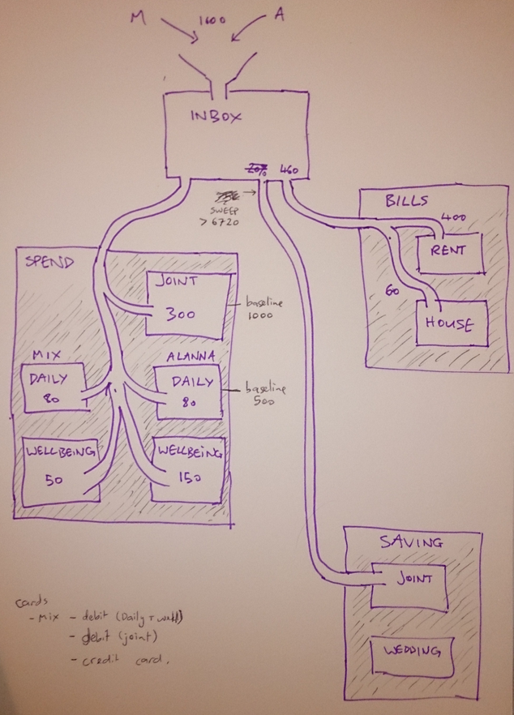

# Relationship

Some notes on how Mix + Alanna relate.
Please feel free to ask questions - I'm publishing this partly as a versioned record, and partly start conversation and learn from others. 

## Retrospectives

[Running Agile Scrum on our Relationship](https://medium.com/@alannallama/running-agile-scrum-on-our-relationship-9b2085c5d747)

## Money

detail :

- All money arrives in INBOX, which holds a 6-week buffer to be able to top up everything downstream
- overflow runs into savings (with Kiwibank Sweep)
- Spend is the only place we have cards attached to :
- Daily = lunches, etc
- Wellbeing = experiment in tracking and valuing spending explicitly for health + wellbeing. (Alanna has some health challenges which we've chosen to invest more in).
- Bills are just fixed ongoing payments

